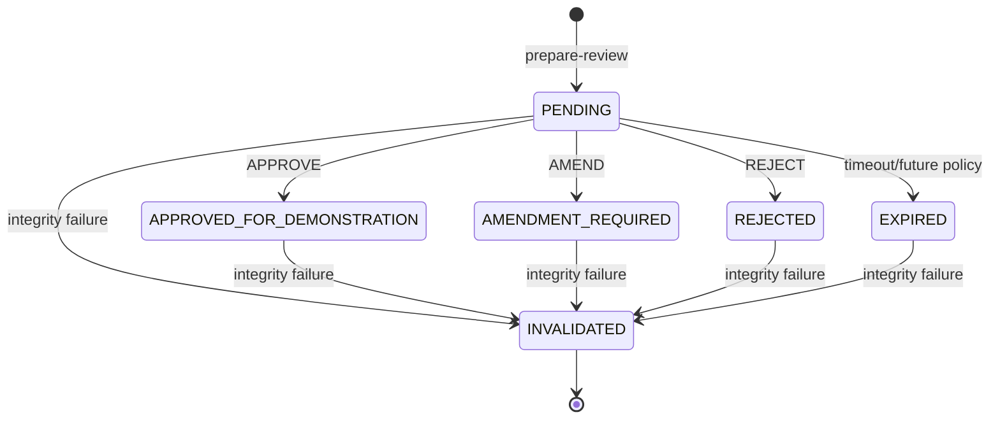

# Review State Machine

Human review states are strict and non-ambiguous.

```mermaid
stateDiagram-v2
    [*] --> PENDING: prepare-review
    PENDING --> APPROVED_FOR_DEMONSTRATION: APPROVE
    PENDING --> AMENDMENT_REQUIRED: AMEND
    PENDING --> REJECTED: REJECT
    PENDING --> EXPIRED: timeout/future policy
    PENDING --> INVALIDATED: integrity failure
    APPROVED_FOR_DEMONSTRATION --> INVALIDATED: integrity failure
    AMENDMENT_REQUIRED --> INVALIDATED: integrity failure
    REJECTED --> INVALIDATED: integrity failure
    EXPIRED --> INVALIDATED: integrity failure
    INVALIDATED --> [*]
```

Only `PENDING` can receive approve, amend or reject decisions. Repeated approval is rejected.
