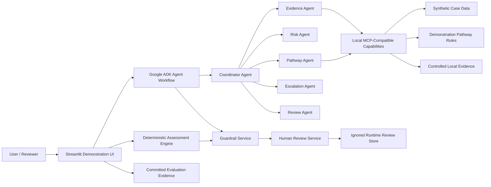

# Architecture Summary

The project is organised around clear trust boundaries. Deterministic services calculate pathway status and operational risk. Google ADK agents coordinate the workflow. Local MCP-compatible capabilities provide structured interoperability for case data, pathway rules and evidence. Agent Skills package reusable tasks. Guardrails inspect inputs and outputs. Human review records explicit decisions. The Streamlit UI displays the synthetic workflow, and the deployment package is Cloud Run-ready without embedding credentials.

## Data Flow

1. The user selects a synthetic case.
2. Deterministic services calculate pathway and risk values.
3. The ADK workflow coordinates specialist agents.
4. In `mock-mcp` mode, agents access local MCP-compatible capabilities.
5. Controlled evidence is retrieved and displayed with validation warnings.
6. Guardrails check integrity, unsafe claims and review invariants.
7. Human review records a demonstration decision.
8. Evaluation evidence is displayed from committed Milestone 6 artifacts.

## Boundaries

- Deterministic boundary: Pathway status, target consumption, breach status and risk score are deterministic.
- Model boundary: Mock and mock-MCP agent orchestration does not call Gemini.
- MCP boundary: Local bounded capabilities expose synthetic case, rule and evidence data.
- Review boundary: Review decisions require explicit reviewer alias and remain `submitted=false`.
- Deployment boundary: Docker and Cloud Run-ready files are included, but deployment is not performed.
- Security boundary: Guardrails, redaction and download restrictions reduce risk without claiming perfect protection.

